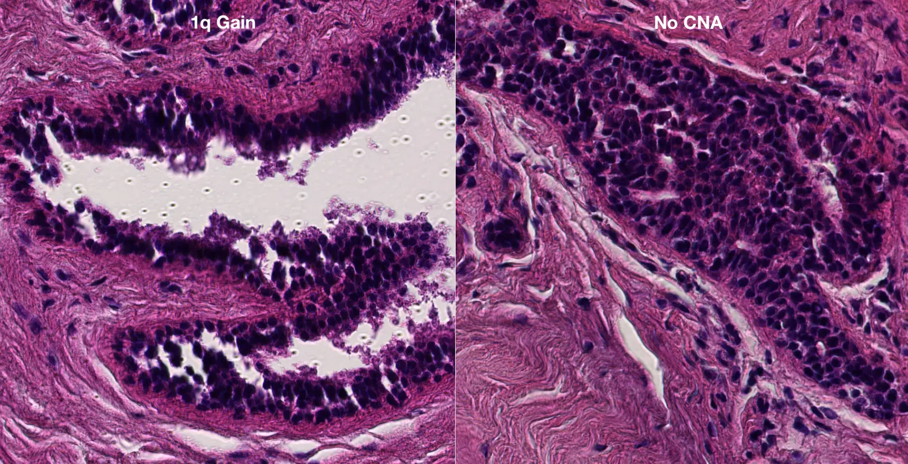

# Computer-Vision Classifier of 1q Gain in Breast Epithelium

This project processes breast histology slides to classify samples based on copy number (CN) events, specifically focusing on 1q gain detection.
This training pipeline processes Hamamatsu NDPI slide scans with NDPA annotations taken after laser capture microdissection (LCM) subsequently
whole genome sequenced to determine copy number changes.

## Project Overview

The project consists of these training scripts that work in sequence to:

1. **Pair slide images (.ndpi) with their most recent free-form annotations (.ndpa)** (`01_get_ndpa_pairs.py`)
2. **Extract a cropped image from the cut area (determined from the coordinates of the annotated regions)** (`02_extract_cuts_from_slide_scan.py`)
3. **Map samples to copy number events (1q gain or no CN event)** (`03_map_slide_to_CN.py`)
4. **Train a machine learning model to classify copy number events (like 1q gain)** (`04_train_model.py`)

## Script Descriptions

### 1. `01_get_ndpa_pairs.py` - NDPI/NDPA Pairing

**Purpose**: Automatically discovers and pairs Hamamatsu NDPI slide files with their corresponding NDPA annotation files.

**What it does**:

- Scans a base directory (`/Volumes/casm-lcm/tb14/Breast/`) for NDPI files
- Filters for slides containing "slide" and "PD" in the path
- Matches each NDPI file with its corresponding NDPA annotation file based on overlapping basename
- Handles filename variations (e.g., `.edited` suffixes, ISO-8601 date stamps)
- Selects the most recently modified NDPA file if multiple exist
- Outputs a JSON mapping of NDPI paths to NDPA paths

**Output**: `ndpi_ndpa_pairs.json` - A JSON file mapping NDPI slide paths to their annotation files

**Usage**:

```bash
python 01_get_ndpa_pairs.py
```

### 2. `02_extract_cuts_from_slide_scan.py` - Tissue Region Extraction

**Purpose**: Extracts cropped tissue regions from NDPI slides based on NDPA polygon annotations.

**What it does**:

- Reads NDPA XML files containing free-form polygon annotations
- Parses annotation coordinates and converts them to pixel coordinates
- Extracts a cropped image for each of the annotated regions
- Saves crops as WebP images (80% quality) for efficient storage
- Dynamically handles coordinate transformations and slide offsets based on the slide metadata

**Usage**:

```bash
# Batch mode (recommended)
python 02_extract_cuts_from_slide_scan.py \
    --pairs Output/ndpi_ndpa_pairs.json \
    --out Output/ndpi_crops \
    --verbose
```

**Output**: Directory structure with subdirectories for each slide containing WebP crops

### 3. `03_map_slide_to_CN.py` - Copy Number Event Mapping

**Purpose**: Associates extracted tissue crops with copy number event data and patient metadata.

**What it does**:

- Reads copy number events spreadsheet (contains sample IDs and CN events)
- Reads master section details spreadsheet (contains patient metadata)
- Scans the cropped images directory to find available tissue samples
- Categorizes samples into four groups:
  - **"tumour"**: tumour samples
  - **"1q"**: Samples with 1q gain events
  - **"16q"**: Samples with 16q loss events
  - **"1q or 16q"**: Samples with 1q gain or 16q loss events
  - **"no CN"**: Samples with no copy number events
- Associates each sample with its metadata and image paths
- Creates a hierarchical JSON structure for downstream analysis

**Input Requirements**:

- **Copy number events spreadsheet**: Must contain `Sample` and `Event` columns
- **Master section details spreadsheet**: Must contain `sampleID`, `Patient_Category`, `PD_ID`, `Slide_Description`, `Tissue_Type`
- **Cropped images directory**: WebP files from script 2

**Output Structure**:

```json
{
  "tumour": {
    "<sampleID>": {
      "paths": ["path/to/image1.webp", "path/to/image2.webp"],
      "Patient_Category": "...",
      "PD_ID": "...",
      "Slide_Description": "...",
      "Tissue_Type": "..."
    }
  },
  "normal": {
    "<sampleID>": { ... }
  }
}
```

**Usage**:

```bash
python 03_map_slide_to_CN.py \
    --cn Data/copy_number_events_GRCh38_211108.xlsx \
    --master Data/Breast_LCM_Section_Details_210323.xlsx \
    --slides Output/ndpi_crops \
    --out_dir Output/
```

## Complete Pipeline

To run the entire pipeline:

```bash
# Step 1: Pair NDPI slides with annotations
python 01_get_ndpa_pairs.py

# Step 2: Extract tissue crops
python 02_extract_cuts_from_slide_scan.py \
    --pairs Output/ndpi_ndpa_pairs.json \
    --out Output/ndpi_crops

# Step 3: Map to copy number events
python 03_map_slide_to_CN.py \
    --cn Data/copy_number_events_GRCh38_211108.xlsx \
    --master Data/Breast_LCM_Section_Details_210323.xlsx \
    --slides Output/ndpi_crops \
    --out_dir Output/
```

## Dependencies

- **Python 3.x**
- **pandas**: For spreadsheet processing
- **openpyxl**: For Excel file reading
- **openslide**: For NDPI slide reading
- **Pillow (PIL)**: For image processing and WebP output
- **pathlib**: For file path handling

## Data Structure

The project expects the following directory structure:

```
├── Data/
│   ├── copy_number_events_GRCh38_211108.xlsx
│   └── Breast_LCM_Section_Details_210323.xlsx
├── Output/
│   ├── ndpi_ndpa_pairs.json  # Generated by script 1
│   ├── ndpi_crops/           # Generated by script 2
│   ├── tumour_vs_normal.json  # Generated by script 3
│   ├── normal_CN_vs_noCN.json  # Generated by script 3
│   ├── normal_1q_vs_noCN.json  # Generated by script 3
│   └── normal_1q_or_16q_loss_vs_noCN.json  # Generated by script 3
```

## Notes

- The pipeline is designed for breast epithelium slides
- Sample IDs must match between the spreadsheets and image filenames
- The system automatically handles filename variations and coordinate transformations
- Output images are optimized for storage efficiency using WebP format
- The final JSON mapping can be used for training machine learning models to classify 1q gain events

# Results

## Tumour vs Normal Classification

Using the provided pipeline, we trained a UNI ViT-L/16 classifier for tumour vs normal on breast LCM crops and achieved:

**Test F1 (normal): 0.979**

**Command used:**

```bash
python 04_train_UNI_on_CN.py \
  --json Output/tumour_vs_normal.json \
  --root Output/ndpi_crops \
  --out_dir Output/ClassificationTraining/uni_tumour_vs_normal \
  --epochs 20 --batch 24 --patience 10
```

**Run summary:**

- Best validation F1 (normal): 0.986
- Test F1 (macro): 0.979
- Epochs trained: 20

---

## 1q Gain vs No CN Classification

We trained a UNI ViT-L/16 classifier to distinguish normal samples with 1q gain from those with no CN event.



**Test F1 (normal_1q): 0.993**

**Command used:**

```bash
python 04_train_UNI_on_CN.py \
  --json Output/normal_1q_vs_noCN.json \
  --root Output/ndpi_crops \
  --out_dir Output/ClassificationTraining/uni_1q_v_noCN \
  --epochs 30 --batch 24 --patience 10
```

**Run summary:**

- Best validation F1 (normal_1q): 0.997
- Test F1 (normal_1q): 0.993
- Test F1 (macro): 0.993
- Epochs trained: 29 (early stopping)
